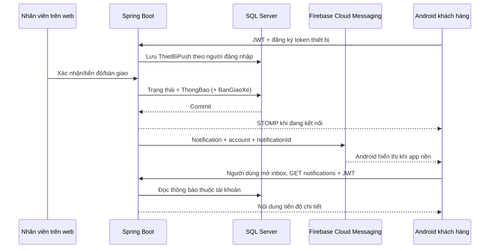

# Cấu hình FCM Android và kịch bản thuyết trình

Cập nhật: 2026-09-22. Đây là hướng dẫn thực hiện tiếp; **chưa tạo project Firebase, chưa tải credentials, chưa gửi push thật trong phiên này**. Code vẫn dùng SQL Server, không cần Firestore/Realtime Database hay Firebase Authentication.

## 1. Phân biệt vai trò

- SQL Server lưu tài khoản, lịch hẹn, xe, sửa chữa, hóa đơn, thông báo và lịch sử bàn giao.
- FCM chuyển tín hiệu từ Spring Boot đến Android khi Flutter không chạy ở foreground.
- STOMP và REST cập nhật inbox trong app; SQL là nguồn dữ liệu chuẩn, push không phải chứng từ nghiệp vụ.



## 2. Tạo Firebase project và ứng dụng Android

1. Mở [Firebase Console](https://console.firebase.google.com/), đăng nhập tài khoản của nhóm, chọn tạo project. Đặt tên dễ nhận biết và ghi lại **Project ID**, không nhầm với display name.
2. Có thể tắt Google Analytics nếu không cần; không tạo Firestore cho tính năng này.
3. Trong Project settings, thêm Android app với package **`com.garage.garage_mobile`**, khớp `mobile/android/app/build.gradle.kts`. Không tự đổi package. FCM cơ bản không cần cấu hình SHA signing fingerprint như một số dịch vụ đăng nhập.
4. Tải `google-services.json`, đặt đúng `mobile/android/app/google-services.json`. Dự án đã có Gradle Google Services plugin, chỉ apply khi file tồn tại; không cần thêm plugin lần hai hoặc tạo `firebase_options.dart` cho cách cấu hình Android hiện tại.
5. Đảm bảo Firebase Cloud Messaging API (HTTP v1) của project đang được bật. Không dùng legacy server key.

File Android cung cấp cấu hình app, **không phải private key server**. Repo đã ignore file này để mỗi môi trường tự cấu hình. Kiểm tra tài liệu chính thức: [FCM Flutter](https://firebase.google.com/docs/cloud-messaging/flutter/get-started), [Firebase API keys](https://firebase.google.com/docs/projects/api-keys).

## 3. Cấu hình backend

1. Project settings -> Service accounts -> Firebase Admin SDK. Người quản trị được phép tạo private key cho môi trường demo local. Nếu chính sách tổ chức cấm key, dùng cơ chế Application Default Credentials được tổ chức cho phép, không tìm cách vượt chính sách.
2. Đặt JSON server ngoài repository, ví dụ `D:\KLCN\Garage_Secrets\garage-fcm-service-account.json`. Không gửi nội dung file qua chat, không đưa vào mobile/web, không commit.
3. Trong chính terminal sẽ chạy backend, khai báo biến môi trường (thay placeholder bằng cấu hình của nhóm):

```powershell
$env:GARAGE_PUSH_ENABLED = 'true'
$env:GARAGE_PUSH_PROJECT_ID = '<PROJECT_ID>'
$env:GOOGLE_APPLICATION_CREDENTIALS = 'D:\KLCN\Garage_Secrets\garage-fcm-service-account.json'
Set-Location D:\KLCN\Garage_Management\backend
mvn spring-boot:run
```

Nếu chạy bằng IDE, đặt ba biến trong Run Configuration; terminal khác không tự nhận các biến trên. Backend dùng Firebase Admin SDK và `GoogleCredentials.getApplicationDefault()`. Project ID, file Android và quyền service account phải tương thích cùng project. Khi bật FCM mà credentials sai, khởi tạo backend có thể thất bại: sửa cấu hình hoặc tắt flag, không chép key vào source.

Khi chưa cấu hình, để `GARAGE_PUSH_ENABLED` không đặt hoặc `false`: không khởi tạo Firebase Admin, inbox SQL/STOMP vẫn dùng được. Chỉ thêm biến vào `.env` sẽ không có tác dụng nếu cách chạy backend không nạp `.env`.

Nguồn chính thức: [Firebase Admin setup và ADC](https://firebase.google.com/docs/admin/setup), [Gửi bằng Admin SDK](https://firebase.google.com/docs/cloud-messaging/send/admin-sdk).

## 4. Database và chạy lại app

Trước thử đăng ký thiết bị/bàn giao, người phụ trách DB phải review và áp dụng migration theo [tài liệu schema/API cho web](HANDOVER_WEB_HANDOFF.md). Không chạy toàn bộ file schema lên DB đã có dữ liệu.

Người dùng tự thực hiện:

```powershell
Set-Location D:\KLCN\Garage_Management\mobile
flutter pub get
flutter run
```

Dừng app cũ trước khi chạy lại; hot reload không áp dụng cấu hình Firebase/manifest/Gradle mới. Dùng emulator Android Studio có Google Play services (image Google APIs/Google Play phù hợp) và Internet. Backend trên máy Windows vẫn được mobile emulator gọi qua `10.0.2.2:8080`; kết nối đó độc lập với kết nối Internet tới FCM.

Đăng nhập CUSTOMER và chấp nhận quyền thông báo. Android 13+ có quyền thông báo runtime; hệ điều hành có thể không hỏi lại nếu đã quyết định trước đó. Kiểm tra Settings -> Apps -> AutoCare -> Notifications nếu không thấy hộp thoại. Android cũ hơn không có cùng hộp thoại quyền runtime. Không suy ra lỗi FCM chỉ từ việc không thấy popup xin quyền.

FCM cần app được mở ít nhất một lần. Android Force stop trong Settings là trường hợp khác với về Home/đóng app bình thường: cần mở lại app để nhận tiếp. Xem [nhận thông báo trong Flutter](https://firebase.google.com/docs/cloud-messaging/flutter/receive-messages).

## 5. Demo end-to-end

1. Đăng nhập CUSTOMER trên emulator; vào tab Thông báo để xác minh REST hoạt động. Dùng web mở lịch/xe đúng khách, đúng chi nhánh.
2. Xác nhận lịch trên web: inbox xuất hiện thông báo xác nhận. Không dùng lại cùng trạng thái để thử vì backend chống thông báo trùng.
3. Đưa app về Home. Web tiếp nhận xe hoặc đổi sang giai đoạn hợp lệ tiếp theo. Xem thanh thông báo Android.
4. Bấm push: app mở inbox đúng tài khoản. Màn khóa chỉ hiển thị nội dung chung; nội dung chi tiết nằm trong app.
5. Hoàn tất phiếu sửa chữa chính: inbox có lời mời đến garage kiểm tra, thanh toán và nhận xe. Phiếu con hoàn tất không có lời mời lấy toàn bộ xe.
6. Web mở chi tiết tiếp nhận: khi chưa đủ hóa đơn/thanh toán hoặc còn phiếu chưa xong, phần Bàn giao xe hiển thị lý do chưa được phép.
7. Sau khi đủ điều kiện và đã giao xe thực tế, tick xác nhận, nhập ghi chú, bấm Xác nhận đã bàn giao. Kiểm tra người/thời gian audit, trạng thái và thông báo khách.
8. Thử gửi lại cùng thao tác: không tạo audit/thông báo thứ hai. Kiểm tra khách khác và nhân viên khác chi nhánh không xem/thao tác sai phạm vi.
9. Đăng xuất, đăng nhập tài khoản khác trên cùng thiết bị: thao tác cho khách cũ không được mở inbox của khách mới. Thử cả foreground, background và mở app từ trạng thái bị hệ điều hành kết thúc bình thường.

Không in token đầy đủ để thuyết trình. Có thể kiểm tra số thiết bị mà không lộ token:

```sql
SELECT MaNguoiDung, COUNT(*) AS SoThietBi, MAX(CapNhatLuc) AS CapNhatGanNhat
FROM dbo.ThietBiPush GROUP BY MaNguoiDung;
```

## 6. Chẩn đoán nhanh

| Hiện tượng | Kiểm tra |
|---|---|
| Inbox trống | Backend mới đã chạy? Thao tác có đổi trạng thái thật? Xe thuộc đúng tài khoản? API notifications có trả dữ liệu? |
| Inbox có, không có push nền | File Android đúng package/project? Backend bật flag và có quyền gửi? Thiết bị đăng ký được vào SQL? Quyền thông báo/channel có bật? |
| FCM not configured trong debug | Kiểm tra vị trí JSON, dừng/chạy lại native app; app đang dùng fallback inbox/local |
| Không có bảng ThietBiPush/BanGiaoXe | Chưa áp V03 vào đúng database; phối hợp người phụ trách DB |
| Bật FCM thì backend không khởi động | Kiểm tra đường dẫn ADC, quyền đọc file, Project ID và quyền service account |
| Push không tới sau Force stop | Mở lại app rồi test bằng nút Home, không dùng Force stop |
| Không hiện câu mời nhận xe trên màn khóa | Thiết kế bảo vệ riêng tư: mở inbox để đọc nội dung nghiệp vụ |
| Bàn giao bị chặn dù phiếu chính xong | Kiểm tra phiếu con và tất cả hóa đơn phải thanh toán đầy đủ |
| Đăng xuất báo lỗi | Cả hủy token server và xóa token FCM có thể đang mất mạng; thử lại khi có kết nối |

Token FCM có thể đổi; app theo dõi token refresh và đăng ký lại, backend bỏ qua token không cập nhật quá 60 ngày và loại token FCM báo `UNREGISTERED`. Chính sách 60 ngày là lựa chọn của dự án, không phải bảo đảm tuổi thọ token của Google. Tham khảo [quản lý token](https://firebase.google.com/docs/cloud-messaging/manage-tokens).

## 7. Lời thuyết trình ngắn

“Hệ thống vẫn dùng SQL Server để lưu toàn bộ nghiệp vụ. Khi nhân viên cập nhật tiến độ, backend kiểm tra quyền và chi nhánh, lưu trạng thái cùng thông báo trong một giao dịch. Sau khi giao dịch thành công, hệ thống phát cập nhật trong app và gửi qua FCM để Android có thể hiển thị khi app chạy nền. Khi khách bấm thông báo, app dùng JWT lấy chi tiết chính chủ từ backend. Hoàn tất sửa chữa chỉ là mốc mời khách đến nhận xe; nhân viên còn phải xác nhận bàn giao riêng sau khi đáp ứng điều kiện sửa chữa và thanh toán. Chứng từ bàn giao lưu người thực hiện và thời gian, giúp truy vết mà không nhầm hoàn tất kỹ thuật với giao xe thực tế.”

Nêu rõ giới hạn khi được hỏi: code đã có nhưng cần cấu hình và demo thật; chưa hỗ trợ APNs/iOS; push phụ thuộc mạng/quyền/OS, không cam kết tới tức thời hay đúng một lần. Chưa có outbox lưu bền vững để tự gửi lại sau khi backend chết; inbox SQL vẫn giữ dữ liệu nghiệp vụ. Thông báo đang trên đường gửi có thể đến sau logout, nhưng payload chung không chứa chi tiết xe và app kiểm tra account khi mở.
